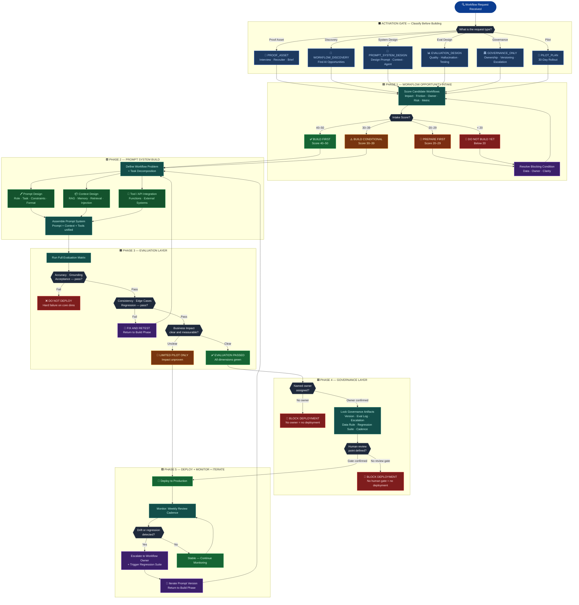

# Prompt Engineering Operating Model


---

## Executive Brief

AI infrastructure companies cannot afford informal internal AI adoption.

The same rigor applied to infrastructure products must be applied to internal LLM workflows: workflow selection, prompt and context design, output evaluation, human review, governance, versioning, and measurable business impact.

The **Prompt Engineering Operating Model (PEOM)** turns scattered prompt experimentation into evaluated, governed, deployable AI workflows.

This repository is a proof asset. It demonstrates how prompt engineering is treated as product infrastructure — not isolated instruction writing.

---

## The Three Questions

These are the executive entry points before any workflow is touched.

### C-Suite

> Which internal workflow, if improved by 30%, creates the most leverage across the company without increasing operational risk?

### Engineering / AI Leadership

> Are prompts treated as versioned product infrastructure with evaluation and regression checks — or as one-off instructions living in someone's notebook?

### Operations

> Where are high-context employees repeatedly translating messy information into decisions that AI could support, but not fully own?

If a company cannot answer these questions, that is the discovery engagement.

---

## Core Thesis

Prompt engineering is not better wording.

It is the operating discipline for shaping model behavior inside real business workflows. A production-ready prompt system requires a clear workflow owner, a defined business task, reliable context, testable outputs, human review, evaluation logs, regression checks, and monitoring.

If those components are missing, the organization does not have an AI workflow. It has an experiment.

---

## PEOM Workflow — Full System Architecture



---

## Workflow Opportunity Intake

PEOM scores candidate workflows before recommending any build.

| Dimension | What It Determines |
|---|---|
| Business impact | Whether the workflow matters enough to improve |
| Current friction | How much manual effort, delay, or inconsistency exists |
| Manual hours burned | Whether the labor cost justifies automation |
| Named workflow owner | Whether someone has authority to change the process |
| Data availability | Whether the workflow has usable inputs |
| Tool / API access | Whether the workflow can connect to real systems |
| LLM suitability | Whether the task fits language, reasoning, retrieval, or generation |
| Decision risk | What happens if the AI is wrong |
| Human review point | Where accountability remains human-owned |
| Success metric | How improvement will be measured |

### Intake Verdict

| Score | Decision | Meaning |
|---|---|---|
| 40–50 | **Build First** | High-value workflow with owner, data, and review path |
| 30–39 | **Build Conditional** | Worth pursuing after the blocking condition is resolved |
| 20–29 | **Prepare First** | Data, ownership, or process clarity is not ready |
| Below 20 | **Do Not Build Yet** | Automation would create more risk than leverage |

---

## Evaluation Layer

Evaluation is the difference between a prompt that works once and a system that can be trusted.

| Evaluation Area | Test Question |
|---|---|
| Accuracy | Is the output correct against ground truth? |
| Consistency | Does the same input produce stable outputs? |
| Grounding | Are claims supported by the provided context? |
| Hallucination | Did the model invent facts, citations, or assumptions? |
| Edge cases | Does it handle missing, malformed, or out-of-scope input? |
| Task completion | Did it complete the business task — not just respond? |
| User acceptance | Would the workflow owner approve the result? |
| Regression | Do previous test cases still pass after prompt changes? |
| Business impact | Did time, quality, risk, or throughput improve? |

### Deployment Rules

| Failure Type | Decision |
|---|---|
| Accuracy failure | **Do not deploy** |
| Grounding failure | **Do not deploy** |
| Acceptance failure | **Do not deploy** |
| Consistency failure | Fix and retest |
| Edge case failure | Fix and retest |
| Regression failure | Fix and rerun full suite |
| Impact unclear | Limited pilot only |

---

## Governance Model

Prompts are infrastructure. Infrastructure requires governance.

Every deployed AI workflow must include:

| Requirement | Description |
|---|---|
| Versioned prompt artifact | Stored, dated, and diff-tracked |
| Named workflow owner | Single accountable person — not a team |
| Human approval point | Defined gate before the output acts or routes |
| Evaluation log | Pass/fail recorded per eval dimension per version |
| Runtime escalation criteria | Conditions that trigger human override |
| Sensitive data rule | PII handling and data boundary explicitly defined |
| Regression test suite | Minimum 5 test cases per workflow |
| Monitoring cadence | Weekly review minimum — escalate on drift |

**No owner = no deployment.** This is non-negotiable.

---

## Example Internal AI Workflows

| Workflow | AI Role | Human Owner | Primary Risk |
|---|---|---|---|
| C-suite briefing assistant | Summarize and synthesize operational updates | Executive operations | Inaccurate figures |
| Security questionnaire assistant | Retrieve and draft structured responses | Security / Legal | Compliance exposure |
| Engineering knowledge copilot | Retrieve internal system knowledge | Engineering lead | Hallucinated system behavior |
| Sales technical response assistant | Draft technical responses | Sales engineering | Unsupported product claims |
| Product feedback classifier | Summarize and classify customer feedback | Product manager | Loss of nuance |
| SOP assistant | Answer policy and process questions | Operations owner | Outdated source material |

---

## 30-Day Pilot Plan

| Week | Focus | Output |
|---|---|---|
| Week 1 | Workflow discovery | Ranked workflow candidates and named owner confirmed |
| Week 2 | Prompt and context prototype | First working workflow prototype with eval baseline |
| Week 3 | Evaluation and feedback loop | Test cases, evaluation matrix, revision cycle |
| Week 4 | Limited pilot and executive readout | Pilot results, governance plan, next-build recommendation |

---

## Executive Readout Format

1. What workflow was selected and why it was prioritized
2. What the evaluation matrix showed — dimension by dimension
3. What governance was required before deployment was permitted
4. What business impact was observed or projected
5. What should be built next and in what sequence

---

## Repository Structure

```text
.
├── README.md
├── index.html
├── docs/
│   ├── workflow-opportunity-intake.md
│   ├── prompt-lifecycle.md
│   ├── evaluation-layer.md
│   ├── governance-model.md
│   └── 30-day-pilot-plan.md
├── assets/
│   ├── peom-workflow-diagram.png
│   └── evaluation-matrix.png
└── skill/
    └── SKILL.md
```

---

## What This Demonstrates

This repository shows how prompt engineering is treated in a business context.

Not as a writing exercise. As workflow architecture.

The value is not producing a better model response. The value is designing the operating conditions that make model behavior useful, measurable, governable, and safe enough to place inside a real business process.

---

**Prompt Engineering Operating Model v1.2**
McDonald (2026) | DACR License v2.7 | Epoch Frameworks LLC
Proprietary methodology. Public artifact shares the operating model, not the retained scoring logic.

