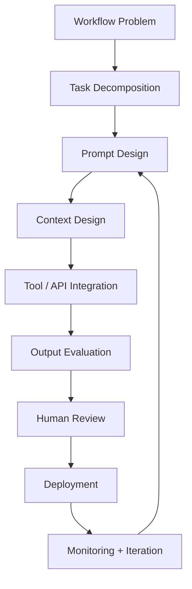

# Prompt Engineering Operating Model


## Executive Brief

AI infrastructure companies cannot afford informal internal AI adoption.

The same rigor applied to infrastructure products should be applied to internal LLM workflows: workflow selection, prompt and context design, output evaluation, human review, governance, versioning, and measurable business impact.

The **Prompt Engineering Operating Model (PEOM)** turns scattered prompt experimentation into evaluated, governed, deployable AI workflows.

This repository is a proof asset. It demonstrates how prompt engineering can be treated as product infrastructure rather than isolated instruction writing.

## The Skill Behind This Use Case

This artifact is powered by the `prompt-engineering-operating-model` Codex skill.

The skill is designed to help scope, evaluate, and govern internal AI workflows for interviews, client discovery, proof assets, pilot plans, and AI infrastructure conversations.

It activates when the work involves:

- Prompt and context engineering
- Internal AI workflow design
- AI infrastructure proof assets
- Workflow opportunity intake
- Prompt evaluation and regression testing
- Human-in-the-loop governance
- AI pilot planning
- Recruiter or executive meeting preparation
- Agent and copilot workflow scoping

The skill does not start with the prompt. It starts with the workflow.

## Core Thesis

Prompt engineering is not better wording.

It is the operating discipline for shaping model behavior inside real business workflows.

A production-ready prompt system requires:

- A clear workflow owner
- A defined business task
- Reliable context
- Testable outputs
- Human review
- Evaluation logs
- Regression checks
- Monitoring and iteration

If those pieces are missing, the organization does not have an AI workflow. It has an experiment.

## The Three Questions

These are the executive entry points for the model.

### C-Suite Question

> Which internal workflow, if improved by 30%, would create the most leverage across the company without increasing operational risk?

### Engineering / AI Leadership Question

> Are prompts being treated as product infrastructure with versioning, evaluation, and regression checks, or as one-off instructions living in someone's notebook?

### Operations Question

> Where are high-context employees repeatedly translating messy information into decisions that AI could support, but not fully own?

If a company cannot answer these questions, that is the discovery engagement.

## PEOM Workflow



## Workflow Opportunity Intake

PEOM scores candidate workflows before recommending a build.

| Dimension | What It Determines |
|---|---|
| Business impact | Whether the workflow matters enough to improve |
| Current friction | How much manual effort, delay, or inconsistency exists |
| Manual hours burned | Whether the labor cost justifies automation |
| Named workflow owner | Whether someone has authority to change the process |
| Data availability | Whether the workflow has usable inputs |
| Tool / API access | Whether the workflow can connect to real systems |
| LLM suitability | Whether the task fits language, reasoning, retrieval, or generation |
| Decision risk | What happens if the AI is wrong |
| Human review point | Where accountability remains human-owned |
| Success metric | How improvement will be measured |

### Intake Verdict

| Score | Decision | Meaning |
|---|---|---|
| 40-50 | Build First | High-value workflow with owner, data, and review path |
| 30-39 | Build Conditional | Worth pursuing after the missing condition is resolved |
| 20-29 | Prepare First | Data, ownership, or process clarity is not ready |
| Below 20 | Do Not Build Yet | Automation would create more risk than leverage |

## Evaluation Layer

Evaluation is the difference between a prompt that works once and a system that can be trusted.

| Evaluation Area | Test Question |
|---|---|
| Accuracy | Is the output correct against ground truth? |
| Consistency | Does the same input produce stable outputs? |
| Grounding | Are claims supported by the provided context? |
| Hallucination | Did the model invent facts, citations, or assumptions? |
| Edge cases | Does it handle missing, malformed, or out-of-scope input? |
| Task completion | Did it complete the business task, not just answer? |
| User acceptance | Would the workflow owner approve the result? |
| Regression | Do previous test cases still pass after prompt changes? |
| Business impact | Did time, quality, risk, or throughput improve? |

### Deployment Rule

| Failure Type | Deployment Decision |
|---|---|
| Accuracy failure | Do not deploy |
| Grounding failure | Do not deploy |
| Acceptance failure | Do not deploy |
| Consistency failure | Fix and retest |
| Edge case failure | Fix and retest |
| Regression failure | Fix and rerun full suite |
| Impact unclear | Limited pilot only |

## Governance Model

Prompts are infrastructure. Infrastructure requires governance.

Every deployed AI workflow should include:

- Versioned prompt artifact
- Named workflow owner
- Human approval point
- Evaluation log
- Runtime escalation criteria
- Sensitive data rule
- Regression test suite
- Monitoring cadence

No owner means no deployment.

## Example Internal AI Workflows

| Workflow | AI Role | Human Owner | Primary Risk |
|---|---|---|---|
| C-suite briefing assistant | Summarize and synthesize operational updates | Executive operations | Inaccurate figures |
| Security questionnaire assistant | Retrieve and draft structured responses | Security / legal | Compliance exposure |
| Engineering knowledge copilot | Retrieve internal system knowledge | Engineering lead | Hallucinated system behavior |
| Sales technical response assistant | Draft technical responses | Sales engineering | Unsupported product claims |
| Product feedback classifier | Summarize and classify feedback | Product manager | Loss of nuance |
| SOP assistant | Answer policy and process questions | Operations owner | Outdated source material |

## 30-Day Pilot Plan

| Week | Focus | Output |
|---|---|---|
| Week 1 | Workflow discovery | Ranked workflow candidates and named owner |
| Week 2 | Prompt and context prototype | First working workflow prototype |
| Week 3 | Evaluation and feedback | Test cases, evaluation matrix, revisions |
| Week 4 | Limited pilot and readout | Pilot results, governance plan, next-build recommendation |

## Executive Readout Format

The final readout should be concise enough for leadership and specific enough for engineering.

1. What workflow was selected
2. Why that workflow was selected first
3. What the evaluation showed
4. What governance was required
5. What business impact was observed or expected
6. What should be built next

## What This Demonstrates

This repository is designed to show how I think about prompt engineering in a business context.

I do not treat prompt engineering as a writing exercise. I treat it as workflow architecture.

The value is not only in producing a better model response. The value is in designing the operating conditions that make model behavior useful, measurable, governable, and safe enough to place inside a real business process.

## Use This Artifact For

- Prompt engineer interviews
- AI infrastructure recruiter conversations
- Internal AI workflow architecture discussions
- Startup AI operations planning
- Client discovery
- Pilot scoping
- Executive proof-of-thinking
- GitHub Pages proof asset

## Repository Structure

```text
.
├── README.md
├── index.html
├── docs/
│   ├── workflow-opportunity-intake.md
│   ├── prompt-lifecycle.md
│   ├── evaluation-layer.md
│   ├── governance-model.md
│   └── 30-day-pilot-plan.md
├── assets/
│   ├── peom-workflow-diagram.png
│   └── evaluation-matrix.png
└── skill/
    └── SKILL.md
```

## Closing Thesis

The goal is not more AI usage.

The goal is deployable AI behavior the business can trust.

Prompt engineering becomes strategically valuable when it connects model behavior to workflow ownership, evaluation discipline, governance, and measurable business impact.

---

**Prompt Engineering Operating Model v1.1**  
McDonald (2026) | DACR License v2.6 | Epoch Frameworks LLC  
Proprietary methodology. Public artifact shares the operating model, not the retained scoring logic.
