# MBEL vNext + PEOM vNext — Architecture Workflow Diagrams

**Framework Suite:** Epoch Frameworks LLC  
**Author:** Erwin Maurice McDonald (2026)  
**License:** DACR License v2.7  
**Version:** MBEL v1.5 + PEOM v2.0 (vNext upgrade — Thompson + Jin Integration)  
**Status:** Production

-----

> These diagrams document the full architectural layer sequence for two proprietary frameworks:  
> the **Macro-Behavioral Economics Layer (MBEL)** and the **Prompt Engineering Operating Model (PEOM)**.  
> Both were upgraded in vNext to integrate the **Thompson Economic Incentive Intelligence Layer**  
> and the **Jin Supply Chain Signal Intelligence Layer** as scored environmental diagnostic instruments.  
> Thompson and Jin are not standalone tools — they are routed sub-instruments that feed scored  
> variables back into MBEL and PEOM before any output ships.

-----

## Diagram 1 — MBEL vNext Full Architecture

*Macro-Behavioral Economics Layer with Thompson Economic Incentive Integration*

```mermaid
flowchart TD

  %% ── ENTRY ──────────────────────────────────────────────
  INPUT([" INPUT\n Strategic Decision · Policy · Executive Narrative\n AI System Output · Governance Posture "])
  style INPUT fill:#0d1014,stroke:#4fc3f7,stroke-width:2px,color:#4fc3f7

  GATE{"MBEL ACTIVATION GATE\nClassify input before analysis begins"}
  style GATE fill:#111418,stroke:#fdd663,stroke-width:1.5px,color:#fdd663

  %% ── PILLAR ROUTING ──────────────────────────────────────
  P1["P1 — Algorithmic Substitution Economics\nArrow 1962 · Coase-Williamson\nAcemoglu-Restrepo 2019\nCore Q: What is the true cost of replacing\nhuman judgment with algorithms?"]
  P2["P2 — Immigration & Labor Market Architecture\nBorjas · Card · NAS 2016\nCore Q: What does the literature say about\nworkforce composition and fiscal impact?"]
  P3["P3 — Demographic Dividend\nChetty · Intergenerational Mobility\nCore Q: What are the 20-year fiscal consequences\nof demographic policy shifts?"]
  P4["P4 — Institutional & Transaction Cost Analysis\nCoase · Williamson · Principal-Agent\nCore Q: Where do markets fail and human\njudgment is economically irreplaceable?"]
  P5["P5 — Behavioral-Macro Synthesis\nKahneman · Thaler · Bounded Rationality\nCore Q: How do behavioral constraints produce\nmacro-level economic outcomes?"]
  P6["P6 — Policy Consequence Modeling\nSecond & Third Order Effects\nCore Q: How do we model downstream economic\neffects of major policy or governance shifts?"]

  style P1 fill:#111418,stroke:#81c995,stroke-width:1px,color:#9aa0a8
  style P2 fill:#111418,stroke:#81c995,stroke-width:1px,color:#9aa0a8
  style P3 fill:#111418,stroke:#81c995,stroke-width:1px,color:#9aa0a8
  style P4 fill:#111418,stroke:#81c995,stroke-width:1px,color:#9aa0a8
  style P5 fill:#111418,stroke:#81c995,stroke-width:1px,color:#9aa0a8
  style P6 fill:#111418,stroke:#81c995,stroke-width:1px,color:#9aa0a8

  %% ── SUB-INSTRUMENT ROUTING ──────────────────────────────
  SEL["SNOWFLAKE EQUATION LAB\nIdentity Threat · Structural Force Audit\nAttractor Mapping · Estuarine Constraint\nFires: when identity or behavioral backlash\ndistorts economic analysis"]
  EBT["EBT v2.7\nEvaluative Bias Transference Audit\nObjectivity Laundering Detection\nNNN Governing Layer · DIS Score\nFires: when claims present contested\nfindings as settled science"]
  RA["RESEARCH ANALYZER v3\nEmpirical Claim Validation\nLiterature Synthesis · Confidence Scoring\nFires: when specific empirical anchors\nrequire peer-review verification"]

  style SEL fill:#111418,stroke:#c58af9,stroke-width:1px,color:#9aa0a8
  style EBT fill:#111418,stroke:#c58af9,stroke-width:1px,color:#9aa0a8
  style RA  fill:#111418,stroke:#c58af9,stroke-width:1px,color:#9aa0a8

  %% ── THOMPSON LAYER ──────────────────────────────────────
  THOMPSON_GATE{"THOMPSON LAYER TRIGGER\nFires when input contains:\nStrategic recommendation · Governance claim\nExecutive narrative · AI system output\nwhere incentives may have shaped the conclusion"}
  style THOMPSON_GATE fill:#111418,stroke:#4dd0e1,stroke-width:2px,color:#4dd0e1

  TH1["T-DIM 1 — Incentive Distortion Detection\nScore 0–10\nDoes output favor: revenue preservation · political\nsurvivability · operational optics · governance theater\ncost suppression over resilience?"]
  TH2["T-DIM 2 — Incentive Misalignment Severity\nScore 0–10 → Tier: Low · Moderate · Elevated · Critical\nGap between stated objective and actual\noptimization behavior"]
  TH3["T-DIM 3 — Economic Pressure Mapping\nScore 0–10\nBudget constraints · staffing compression\nscaling pressure · margin sensitivity\ninfrastructure debt · operational latency costs"]
  TH4["T-DIM 4 — Decision Authenticity Assessment\nScore 0–10\nIs the organization solving the actual problem\nor optimizing for the appearance of control?"]
  TH5["T-DIM 5 — Incentive Cascade Detection\nScore 0–10\nDownstream behaviors from upstream incentives\nSecondary risk creation\nDelayed governance collapse indicators"]

  style TH1 fill:#0d1014,stroke:#4dd0e1,stroke-width:1px,color:#9aa0a8
  style TH2 fill:#0d1014,stroke:#4dd0e1,stroke-width:1px,color:#9aa0a8
  style TH3 fill:#0d1014,stroke:#4dd0e1,stroke-width:1px,color:#9aa0a8
  style TH4 fill:#0d1014,stroke:#4dd0e1,stroke-width:1px,color:#9aa0a8
  style TH5 fill:#0d1014,stroke:#4dd0e1,stroke-width:1px,color:#9aa0a8

  THOMPSON_SCORE["THOMPSON COMPOSITE OUTPUT\nGovernance Incentive Conflict Score: 0–50\nEconomic Pressure Index: 0–10\nIncentive Distortion Severity: Low / Moderate / Elevated / Critical\nExecutive Narrative Alignment: Aligned / Misaligned / Theater\nLong-Term Structural Risk Projection: 12-month"]
  style THOMPSON_SCORE fill:#0d1014,stroke:#4dd0e1,stroke-width:2px,color:#4dd0e1

  %% ── MBEL vNEXT VARIABLES (fed by Thompson) ──────────────
  MBEL_VARS["MBEL vNEXT INTEGRATION VARIABLES\n— Fed by Thompson Layer scores —\n\nIRI · Incentive Reinforcement Index 0–10\nDoes the environment economically reward the bias?\n0 = no reward | 10 = bias is economically optimal\n\nEBSS · Economic Bias Sustainment Score 0–10\nHow durable is the bias under economic pressure?\n0 = fragile | 10 = deeply entrenched\n\nODP · Operational Distortion Pressure 0–10\nHow much operational friction distorts stated strategy?\n0 = no distortion | 10 = strategy is operationally impossible\n\nMBEL Governing Question:\n'Would this behavior still occur if the incentive structure changed?'\nScore IRI to answer."]
  style MBEL_VARS fill:#0d1014,stroke:#fc8d62,stroke-width:2px,color:#fc8d62

  %% ── OUTPUT LAYERS ───────────────────────────────────────
  THOMPSON_TEST["THOMPSON TEST — MANDATORY\nCan the decision-maker answer in one sentence\nwhat the economic evidence says they should do differently?\nFAIL → return to analysis\nPASS → proceed to Conversion Layer"]
  style THOMPSON_TEST fill:#111418,stroke:#fdd663,stroke-width:1.5px,color:#fdd663

  L1["LAYER 1 — FULL ANALYSIS\nP1–P6 with empirical anchors\nConfidence calibration per pillar\nSub-instrument routing where triggered\nOL-FLAG on all contested claims"]
  L2["LAYER 2 — CONVERSION LAYER v1.2\nPunchline · Perspective Shift\nReal-World Implication · Friction Strip\nConverts economic analysis into\ndecision-ready executive language"]
  L3["LAYER 3 — VIRAL DISTRIBUTION LAYER v1.3\nHook · Scan Structure · Tension/Payoff\nQuotable Line · Comment Trigger · Human Tone\nOptimizes output for LinkedIn and\nleadership communication channels"]
  L4["LAYER 4 — ECONOMIC TRANSLATION LAYER v1.4\nValue Driver Mapping\nDirectional Impact Estimate\nAssumption Declaration\nTime-to-Impact Horizon\nExecutive Output Line"]
  L5["LAYER 5 — SCENARIO INSTANTIATION LAYER v1.5\nBaseline Definition · Impact Translation\nScenario Output · Sensitivity Band\nExecutive Interpretation Line\nConverts directional economics into\ndollar-denominated fundable models"]

  style L1 fill:#111418,stroke:#81c995,stroke-width:1px,color:#9aa0a8
  style L2 fill:#111418,stroke:#81c995,stroke-width:1px,color:#9aa0a8
  style L3 fill:#111418,stroke:#81c995,stroke-width:1px,color:#9aa0a8
  style L4 fill:#111418,stroke:#81c995,stroke-width:1px,color:#9aa0a8
  style L5 fill:#111418,stroke:#81c995,stroke-width:1px,color:#9aa0a8

  GUARD{"CONFIDENCE FLOOR CHECK\nIRI ≥ 8 → flag: environment rewards the bias\nEBSS ≥ 8 → flag: bias is structurally entrenched\nODP ≥ 8 → flag: strategy is operationally impossible\nAny flag → escalate before output ships"}
  style GUARD fill:#111418,stroke:#f28b82,stroke-width:1.5px,color:#f28b82

  OUTPUT(["OUTPUT SHIPS\nFull 6-layer MBEL assessment\nThompson composite score attached\nIRI · EBSS · ODP declared\nMcDonald 2026 · DACR License v2.7"])
  style OUTPUT fill:#0d1014,stroke:#81c995,stroke-width:2px,color:#81c995

  BLOCKED(["OUTPUT BLOCKED\nHuman review required\nStructured escalation brief only\nNo recommendations issued"])
  style BLOCKED fill:#0d1014,stroke:#f28b82,stroke-width:2px,color:#f28b82

  %% ── FLOW ────────────────────────────────────────────────
  INPUT --> GATE
  GATE -->|"P1: Algorithmic Substitution"| P1
  GATE -->|"P2: Immigration/Labor"| P2
  GATE -->|"P3: Demographic"| P3
  GATE -->|"P4: Institutional"| P4
  GATE -->|"P5: Behavioral-Macro"| P5
  GATE -->|"P6: Policy Modeling"| P6

  P1 -->|"Identity threat detected"| SEL
  P1 -->|"Objectivity Laundering"| EBT
  P1 -->|"Empirical claim validation"| RA
  P4 -->|"Identity threat detected"| SEL
  P5 -->|"Bias in behavioral claims"| EBT
  P6 -->|"Empirical validation needed"| RA

  P1 & P2 & P3 & P4 & P5 & P6 --> THOMPSON_GATE

  THOMPSON_GATE --> TH1
  THOMPSON_GATE --> TH2
  THOMPSON_GATE --> TH3
  THOMPSON_GATE --> TH4
  THOMPSON_GATE --> TH5

  TH1 & TH2 & TH3 & TH4 & TH5 --> THOMPSON_SCORE
  THOMPSON_SCORE --> MBEL_VARS

  MBEL_VARS --> THOMPSON_TEST
  SEL & EBT & RA --> THOMPSON_TEST

  THOMPSON_TEST -->|"PASS"| L1
  L1 --> L2 --> L3 --> L4 --> L5

  L5 --> GUARD
  GUARD -->|"IRI/EBSS/ODP below threshold"| OUTPUT
  GUARD -->|"Any flag triggered"| BLOCKED
```

-----

## Diagram 2 — PEOM vNext Full Architecture

*Prompt Engineering Operating Model with Jin Supply Chain Signal Integration*

```mermaid
flowchart TD

  %% ── ENTRY ──────────────────────────────────────────────
  INPUT([" INPUT\n Workflow Request · Prompt Design Brief\n Operational Recommendation · AI System Output\n Governance Review · Pilot Plan Request "])
  style INPUT fill:#0d1014,stroke:#4fc3f7,stroke-width:2px,color:#4fc3f7

  %% ── ACTIVATION GATE ─────────────────────────────────────
  ACT_GATE{"PEOM ACTIVATION GATE\nClassify lane before any output"}
  style ACT_GATE fill:#111418,stroke:#fdd663,stroke-width:1.5px,color:#fdd663

  LANE_PA["PROOF_ASSET\nInterview · recruiter · AI infra role\nEnterprise prospect brief\n→ GitHub / PDF artifact outline"]
  LANE_WD["WORKFLOW_DISCOVERY\nOrg wants to find AI opportunities\n→ Workflow intake + ranked candidates"]
  LANE_PS["PROMPT_SYSTEM_DESIGN\nNeeds prompt, context, tool, agent\n→ Prompt lifecycle + spec"]
  LANE_ED["EVALUATION_DESIGN\nQuality · hallucination · testing\n→ Evaluation matrix"]
  LANE_GO["GOVERNANCE_ONLY\nPrompts exist, lack ownership\n→ Governance layer only"]
  LANE_PP["PILOT_PLAN\n30-day rollout needed\n→ Pilot plan + success metrics"]

  style LANE_PA fill:#111418,stroke:#4fc3f7,stroke-width:1px,color:#9aa0a8
  style LANE_WD fill:#111418,stroke:#4fc3f7,stroke-width:1px,color:#9aa0a8
  style LANE_PS fill:#111418,stroke:#4fc3f7,stroke-width:1px,color:#9aa0a8
  style LANE_ED fill:#111418,stroke:#4fc3f7,stroke-width:1px,color:#9aa0a8
  style LANE_GO fill:#111418,stroke:#4fc3f7,stroke-width:1px,color:#9aa0a8
  style LANE_PP fill:#111418,stroke:#4fc3f7,stroke-width:1px,color:#9aa0a8

  %% ── WORKFLOW INTAKE SCORE ───────────────────────────────
  WF_INTAKE["WORKFLOW OPPORTUNITY INTAKE\nScore 1–5 per dimension\n\nBusiness Impact — High weight\nCurrent Friction — High weight\nManual Hours Burned — Medium weight\nNamed Workflow Owner — Required\nData Availability — High weight\nLLM Suitability — High weight\nDecision Risk — Inverse score\nHuman Review Point — Required\nMeasurable Success Metric — Required"]
  style WF_INTAKE fill:#111418,stroke:#fdd663,stroke-width:1px,color:#9aa0a8

  WF_VERDICT{"WORKFLOW VERDICT\n40–50 → BUILD FIRST\n30–39 → BUILD CONDITIONAL\n20–29 → PREPARE FIRST\nBelow 20 → DO NOT BUILD YET"}
  style WF_VERDICT fill:#111418,stroke:#fdd663,stroke-width:1.5px,color:#fdd663

  %% ── PROMPT LIFECYCLE ────────────────────────────────────
  PL1["STEP 1 — Workflow Problem Definition\nWhat is the exact business problem?\nWhat does failure look like today?"]
  PL2["STEP 2 — Task Decomposition\nBreak workflow into atomic sub-tasks\nIdentify LLM-suitable vs human-required steps"]
  PL3["STEP 3 — Prompt Design\nSystem instruction · user template\nConstraints · output format · failure rules"]
  PL4["STEP 4 — Context Architecture\nWhat context does the model need?\nWhat must never be fabricated?"]
  PL5["STEP 5 — Tool / API Integration\nExternal data sources · function calls\nRAG · structured output · versioning"]
  PL6["STEP 6 — Output Evaluation\nEval matrix — all 9 dimensions\nGround truth · consistency · hallucination check"]
  PL7["STEP 7 — Human Review Gate\nNamed approver · approval criteria\nEscalation threshold defined"]
  PL8["STEP 8 — Deployment\nVersioned prompt artifact stored\nOwner assigned · governance log opened"]
  PL9["STEP 9 — Monitoring & Iteration\nWeekly review minimum\nRegression suite — 5 test cases minimum"]

  style PL1 fill:#111418,stroke:#81c995,stroke-width:1px,color:#9aa0a8
  style PL2 fill:#111418,stroke:#81c995,stroke-width:1px,color:#9aa0a8
  style PL3 fill:#111418,stroke:#81c995,stroke-width:1px,color:#9aa0a8
  style PL4 fill:#111418,stroke:#81c995,stroke-width:1px,color:#9aa0a8
  style PL5 fill:#111418,stroke:#81c995,stroke-width:1px,color:#9aa0a8
  style PL6 fill:#111418,stroke:#81c995,stroke-width:1px,color:#9aa0a8
  style PL7 fill:#111418,stroke:#81c995,stroke-width:1px,color:#9aa0a8
  style PL8 fill:#111418,stroke:#81c995,stroke-width:1px,color:#9aa0a8
  style PL9 fill:#111418,stroke:#81c995,stroke-width:1px,color:#9aa0a8

  %% ── EVALUATION MATRIX ───────────────────────────────────
  EVAL["EVALUATION MATRIX — 9 DIMENSIONS\nAccuracy: correct against ground truth?\nConsistency: stable outputs on same input?\nGrounding: claims supported by context?\nHallucination: facts/citations invented?\nEdge Cases: handles missing or malformed input?\nTask Completion: business task done, not just response?\nUser Acceptance: workflow owner approves output?\nRegression: prior test cases still pass after changes?\nBusiness Impact: time · error rate · quality improved?"]
  style EVAL fill:#111418,stroke:#fdd663,stroke-width:1.5px,color:#9aa0a8

  EVAL_GATE{"EVALUATION VERDICT\nAccuracy / Grounding / Acceptance FAIL\n→ DO NOT DEPLOY\nConsistency / Edge Case / Regression FAIL\n→ FIX AND RETEST\nBusiness Impact unclear\n→ LIMITED PILOT ONLY"}
  style EVAL_GATE fill:#111418,stroke:#f28b82,stroke-width:1.5px,color:#f28b82

  %% ── JIN LAYER ───────────────────────────────────────────
  JIN_GATE{"JIN LAYER TRIGGER\nFires when input contains:\nOperational plan · fulfillment strategy\nLogistics recommendation · supply chain posture\nAny AI recommendation that must survive\nreal-world execution constraints"}
  style JIN_GATE fill:#111418,stroke:#c58af9,stroke-width:2px,color:#c58af9

  JD1["J-DIM 1 — Logistics Friction Detection\nScore 0–10\nDelivery bottlenecks · choke points\nGeographic dependency · vendor concentration\nInfrastructure fragility · regional instability"]
  JD2["J-DIM 2 — Demand Signal Analysis\nScore 0–10\nForecasting reliability · inventory volatility\nSignal lag · overcorrection patterns\nOperational response timing"]
  JD3["J-DIM 3 — Fulfillment Stability Mapping\nScore 0–10\nExecution consistency · resource pressure\nLabor dependency · maintenance burden\nScaling sustainability"]
  JD4["J-DIM 4 — Operational Latency Modeling\nScore 0–10\nWhere does decision latency create\ndownstream operational degradation?\nWhere do AI recommendations fail under\nreal-world execution constraints?"]
  JD5["J-DIM 5 — Supply Chain Resilience\nScore 0–10 → Tier:\nStable 0–2 · Watchlist 3–5\nElevated Risk 6–8 · Structural Instability 9–10"]

  style JD1 fill:#0d1014,stroke:#c58af9,stroke-width:1px,color:#9aa0a8
  style JD2 fill:#0d1014,stroke:#c58af9,stroke-width:1px,color:#9aa0a8
  style JD3 fill:#0d1014,stroke:#c58af9,stroke-width:1px,color:#9aa0a8
  style JD4 fill:#0d1014,stroke:#c58af9,stroke-width:1px,color:#9aa0a8
  style JD5 fill:#0d1014,stroke:#c58af9,stroke-width:1px,color:#9aa0a8

  JIN_SCORE["JIN COMPOSITE OUTPUT\nSupply Chain Risk Map\nOperational Friction Index: 0–50\nLogistics Dependency Score: 0–10\nFulfillment Stability Assessment: Stable / Watchlist / Elevated / Structural\nLatency Vulnerability Analysis\nEnvironmental Stress Projection: 12-month"]
  style JIN_SCORE fill:#0d1014,stroke:#c58af9,stroke-width:2px,color:#c58af9

  %% ── PEOM vNEXT VARIABLES (fed by Jin) ───────────────────
  PEOM_VARS["PEOM vNEXT INTEGRATION VARIABLES\n— Fed by Jin Layer scores —\n\nLIS · Logistics Integrity Score 0–10\nCan the AI recommendation survive logistics reality?\n0 = fully survivable | 10 = operationally impossible\n\nEFS · Environmental Friction Severity 0–10\nHow severely does environmental friction\ndegrade execution quality?\n0 = no degradation | 10 = complete execution failure\n\nSCSI · Supply Chain Stability Index 0–10\nComposite stability score from Jin Layer dimensions\n0 = fully stable | 10 = structural collapse risk\n\nPEOM Governing Question:\n'Can this recommendation survive contact with operational reality?'\nRoute to Jin Layer for SCSI score."]
  style PEOM_VARS fill:#0d1014,stroke:#fdd663,stroke-width:2px,color:#fdd663

  %% ── GOVERNANCE LAYER ────────────────────────────────────
  GOV["GOVERNANCE LAYER\nVersioned prompt artifact — stored, dated, diff-tracked\nNamed workflow owner — single accountable person\nHuman approval point — defined gate before output acts\nEvaluation log — pass/fail per eval dimension\nRuntime escalation criteria — what triggers human override\nSensitive data rule — PII handling and data boundary\nRegression suite — minimum 5 test cases per workflow\nMonitoring cadence — weekly review minimum\n\nNO OWNER = NO DEPLOYMENT"]
  style GOV fill:#111418,stroke:#fdd663,stroke-width:1.5px,color:#9aa0a8

  %% ── CONFLICT RESOLUTION ─────────────────────────────────
  CONFLICT_GATE{"CROSS-LAYER CONFLICT RESOLUTION\nCompares Thompson output (from MBEL)\nagainst Jin output (from PEOM)\nto arbitrate contradictory signals"}
  style CONFLICT_GATE fill:#111418,stroke:#f28b82,stroke-width:2px,color:#f28b82

  CF1["INCENTIVE-DOMINANT DISTORTION\nThompson: Critical + Jin: Stable\nGovernance failure masking operational competence\n→ Executive narrative audit required"]
  CF2["EXECUTION GAP\nThompson: Low + Jin: Structural Instability\nHonest intent but operationally unachievable\n→ Operational redesign before deployment"]
  CF3["SYSTEM RISK BRIEF\nBoth Thompson: Critical + Jin: Structural\n→ Human review gate — no recommendations issued"]
  CF4["STANDARD ASSESSMENT\nBoth Thompson: Low + Jin: Stable\n→ Full 10-section output · no escalation"]
  CF5["DUAL MONITOR FLAG\nThompson: Elevated + Jin: Watchlist\n→ Both layers scored fully · 30-day monitoring"]

  style CF1 fill:#0d1014,stroke:#fc8d62,stroke-width:1px,color:#9aa0a8
  style CF2 fill:#0d1014,stroke:#fdd663,stroke-width:1px,color:#9aa0a8
  style CF3 fill:#0d1014,stroke:#f28b82,stroke-width:1px,color:#f28b82
  style CF4 fill:#0d1014,stroke:#81c995,stroke-width:1px,color:#9aa0a8
  style CF5 fill:#0d1014,stroke:#fc8d62,stroke-width:1px,color:#9aa0a8

  %% ── HUMAN GATE ──────────────────────────────────────────
  HUMAN_GATE{"HUMAN REVIEW GATE\nMandatory when:\nLIS ≥ 8 · EFS ≥ 8 · SCSI ≥ 8\nOR Thompson Critical triggered\nOR Jin Structural Instability triggered\nCannot be overridden by downstream logic"}
  style HUMAN_GATE fill:#111418,stroke:#f28b82,stroke-width:2px,color:#f28b82

  %% ── INTEGRATION ROUTING ─────────────────────────────────
  INT_UP["UPSTREAM INTEGRATIONS\nAI Adoption Architect v6.5 Layer 0B\n→ MLOps readiness feeding pilot scope\nMOC v4.9 ASIL/ESIL\n→ Ambient signal routing into context design\nFractional CXO Practice Builder v2.6 DVL/RIL\n→ Governance posture feeding pilot scope"]
  INT_DOWN["DOWNSTREAM INTEGRATIONS\n10x Senior BSA\n→ Workflow decomposition for agent spec\nMOC / Fractional CXO\n→ Intake score · governance risk · proof asset framing\nEBT v2.7\n→ Bias audit on evaluation criteria and scoring logic"]

  style INT_UP  fill:#111418,stroke:#4fc3f7,stroke-width:1px,color:#9aa0a8
  style INT_DOWN fill:#111418,stroke:#4fc3f7,stroke-width:1px,color:#9aa0a8

  %% ── OUTPUTS ─────────────────────────────────────────────
  OUTPUT_FULL(["FULL DEPLOYMENT OUTPUT\n10-Section Governed Assessment\nExecutive Summary · Thompson Analysis\nJin Signal Assessment · Governance Findings\nOperational Sustainability · Distortion Indicators\nLogistics Risk · Structural Forecast\nIntervention Layers · Confidence Tier\nMcDonald 2026 · DACR License v2.7"])
  style OUTPUT_FULL fill:#0d1014,stroke:#81c995,stroke-width:2px,color:#81c995

  OUTPUT_BLOCK(["OUTPUT BLOCKED\nSYSTEM RISK BRIEF ONLY\nHuman review required\nNo recommendations issued\nNo deployment authorized"])
  style OUTPUT_BLOCK fill:#0d1014,stroke:#f28b82,stroke-width:2px,color:#f28b82

  %% ── FLOW ────────────────────────────────────────────────
  INPUT --> ACT_GATE
  ACT_GATE -->|"Interview / Proof Asset"| LANE_PA
  ACT_GATE -->|"Org Discovery"| LANE_WD
  ACT_GATE -->|"Prompt Design"| LANE_PS
  ACT_GATE -->|"Eval Design"| LANE_ED
  ACT_GATE -->|"Governance Only"| LANE_GO
  ACT_GATE -->|"Pilot Planning"| LANE_PP

  LANE_WD & LANE_PS & LANE_PA & LANE_ED & LANE_GO & LANE_PP --> WF_INTAKE
  WF_INTAKE --> WF_VERDICT

  WF_VERDICT -->|"BUILD FIRST / CONDITIONAL"| PL1
  WF_VERDICT -->|"PREPARE FIRST"| INT_UP
  WF_VERDICT -->|"DO NOT BUILD YET"| OUTPUT_BLOCK

  INT_UP --> PL1
  PL1 --> PL2 --> PL3 --> PL4 --> PL5 --> PL6

  PL6 --> EVAL
  EVAL --> EVAL_GATE

  EVAL_GATE -->|"DO NOT DEPLOY"| OUTPUT_BLOCK
  EVAL_GATE -->|"FIX AND RETEST"| PL3
  EVAL_GATE -->|"PASS / LIMITED PILOT"| PL7

  PL7 --> JIN_GATE

  JIN_GATE --> JD1
  JIN_GATE --> JD2
  JIN_GATE --> JD3
  JIN_GATE --> JD4
  JIN_GATE --> JD5

  JD1 & JD2 & JD3 & JD4 & JD5 --> JIN_SCORE
  JIN_SCORE --> PEOM_VARS

  PEOM_VARS --> PL8
  PL8 --> GOV
  GOV --> PL9

  PL9 --> CONFLICT_GATE
  CONFLICT_GATE -->|"Critical + Stable"| CF1
  CONFLICT_GATE -->|"Low + Structural"| CF2
  CONFLICT_GATE -->|"Both Critical"| CF3
  CONFLICT_GATE -->|"Both Low"| CF4
  CONFLICT_GATE -->|"Elevated + Watchlist"| CF5

  CF3 --> HUMAN_GATE
  CF1 & CF2 & CF4 & CF5 --> HUMAN_GATE

  HUMAN_GATE -->|"Gate cleared"| INT_DOWN
  HUMAN_GATE -->|"Gate triggered"| OUTPUT_BLOCK

  INT_DOWN --> OUTPUT_FULL
```

-----

## Architecture Reference — Layer Inventory

### MBEL vNext — Layer Map

|Layer                       |Version  |Purpose                                                      |Thompson Integration Point           |
|----------------------------|---------|-------------------------------------------------------------|-------------------------------------|
|Activation Gate             |v1.0     |Classifies input to the correct pillar                       |Pre-Thompson                         |
|Pillars P1–P6               |v1.5     |Six empirical analysis pillars                               |Feed into Thompson trigger           |
|Sub-Instruments             |v1.0     |SEL · EBT · Research Analyzer routing                        |Parallel to Thompson                 |
|**Thompson Layer**          |**vNext**|**Economic incentive intelligence — 5 scored dimensions**    |**Between Pillars and Output Layers**|
|MBEL vNext Variables        |vNext    |IRI · EBSS · ODP — fed by Thompson scores                    |Post-Thompson                        |
|Thompson Test               |v1.0     |Output gate — one-sentence decision trigger                  |Post MBEL vars                       |
|Conversion Layer            |v1.2     |Punchline · Perspective Shift · Implication · Friction Strip |Layer 2 of output stack              |
|Viral Distribution Layer    |v1.3     |Hook · Scan Structure · Quotable Line · Comment Trigger      |Layer 3 of output stack              |
|Economic Translation Layer  |v1.4     |Value Driver · Impact Estimate · Assumptions · Executive Line|Layer 4 of output stack              |
|Scenario Instantiation Layer|v1.5     |Dollar-denominated · Sensitivity Band · Interpretation Line  |Layer 5 — final output gate          |

-----

### PEOM vNext — Layer Map

|Layer                      |Version  |Purpose                                                                   |Jin Integration Point                       |
|---------------------------|---------|--------------------------------------------------------------------------|--------------------------------------------|
|Activation Gate            |v1.2     |Classifies lane — 6 routing options                                       |Pre-Jin                                     |
|Workflow Opportunity Intake|v1.2     |9-dimension scoring — BUILD / CONDITIONAL / PREPARE / BLOCK               |Pre-lifecycle                               |
|Prompt Lifecycle Steps 1–6 |v1.2     |Problem def → Task decomp → Prompt → Context → Tools → Eval               |Pre-Jin                                     |
|Evaluation Matrix          |v1.2     |9-dimension eval — accuracy through business impact                       |Pre-Jin                                     |
|Evaluation Gate            |v1.2     |DEPLOY / FIX-RETEST / LIMITED PILOT routing                               |Pre-Jin                                     |
|**Jin Layer**              |**vNext**|**Supply chain signal intelligence — 5 scored dimensions**                |**Between Human Review Gate and Deployment**|
|PEOM vNext Variables       |vNext    |LIS · EFS · SCSI — fed by Jin scores                                      |Post-Jin                                    |
|Lifecycle Steps 7–9        |v1.2     |Human Review → Deployment → Monitoring                                    |Post-Jin vars                               |
|Governance Layer           |v1.2     |Versioned artifact · Named owner · Escalation criteria                    |Post-deployment                             |
|Conflict Resolution Gate   |vNext    |Cross-layer arbitration — Thompson vs Jin signals                         |Final governance gate                       |
|Human Review Gate          |vNext    |Mandatory escalation when LIS/EFS/SCSI ≥ 8 or Critical flags              |Pre-output                                  |
|Integration Routing        |v1.2     |Upstream: AI Adoption / MOC / Fractional CXO · Downstream: BSA / MOC / EBT|Bookends lifecycle                          |

-----

### Cross-Framework Variable Handoff

|Variable                              |Source Layer   |Destination Framework   |Function                                                   |
|--------------------------------------|---------------|------------------------|-----------------------------------------------------------|
|IRI — Incentive Reinforcement Index   |Thompson (MBEL)|MBEL vNext output block |Scores whether environment rewards the detected bias       |
|EBSS — Economic Bias Sustainment Score|Thompson (MBEL)|MBEL vNext output block |Scores durability of bias under economic pressure          |
|ODP — Operational Distortion Pressure |Thompson (MBEL)|MBEL vNext output block |Scores how much friction distorts stated strategy          |
|LIS — Logistics Integrity Score       |Jin (PEOM)     |PEOM vNext output block |Scores whether AI recommendation survives logistics reality|
|EFS — Environmental Friction Severity |Jin (PEOM)     |PEOM vNext output block |Scores how severely friction degrades execution            |
|SCSI — Supply Chain Stability Index   |Jin (PEOM)     |PEOM vNext output block |Composite stability score from all 5 Jin dimensions        |
|Thompson Composite (0–50)             |Thompson (MBEL)|Conflict Resolution Gate|Cross-framework arbitration with Jin score                 |
|Jin Composite (0–50)                  |Jin (PEOM)     |Conflict Resolution Gate|Cross-framework arbitration with Thompson score            |

-----

### Escalation Trigger Reference

|Condition                         |Layer          |Action                                                                             |
|----------------------------------|---------------|-----------------------------------------------------------------------------------|
|IRI ≥ 8                           |MBEL / Thompson|Flag: environment economically rewards the bias. Escalate before output ships.     |
|EBSS ≥ 8                          |MBEL / Thompson|Flag: bias is structurally entrenched. Redesign incentive architecture.            |
|ODP ≥ 8                           |MBEL / Thompson|Flag: strategy is operationally impossible. Block until redesigned.                |
|LIS ≥ 8                           |PEOM / Jin     |Human gate triggered. AI recommendation cannot survive logistics reality.          |
|EFS ≥ 8                           |PEOM / Jin     |Human gate triggered. Environmental friction causes complete execution failure.    |
|SCSI ≥ 8 + EBSS ≥ 7               |Cross-layer    |SYSTEM RISK BRIEF. No output issued without human review.                          |
|Thompson Critical + Jin Structural|Conflict Gate  |SYSTEM RISK BRIEF. Full system failure — governance and execution both compromised.|
|Thompson Critical + Jin Stable    |Conflict Gate  |Incentive-Dominant Distortion. Governance audit.                                   |
|Thompson Low + Jin Structural     |Conflict Gate  |Execution Gap. Operational redesign required.                                      |

-----

*MBEL v1.5 + PEOM v2.0 (vNext)*  
*Erwin Maurice McDonald · Epoch Frameworks LLC · McDonald (2026)*  
*DACR License v2.7 — Attribution required on all derivative works*  
*Thompson Layer: Economic Incentive Intelligence · Jin Layer: Supply Chain Signal Intelligence*