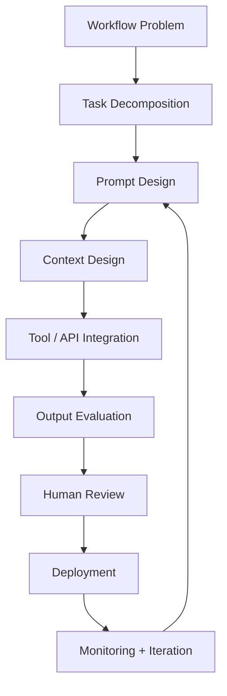

# Prompt Engineering Lifecycle

## Purpose

The Prompt Engineering Lifecycle defines how a workflow moves from business problem to evaluated AI system.

This lifecycle exists because most prompt failures are not wording failures. They are workflow, context, evaluation, ownership, and governance failures.

## Lifecycle Diagram

## Stage 1: Workflow Problem

Define the business problem before defining the prompt.

Required answers:

- What workflow is being improved?
- Who owns it?
- What decision, output, or action does the workflow produce?
- What is broken, slow, inconsistent, expensive, or risky today?
- What does improvement look like in measurable terms?

## Stage 2: Task Decomposition

Break the workflow into smaller tasks.

Classify each task:

| Task Type | Meaning |
|---|---|
| Automate | The AI can complete the task with limited human intervention |
| Augment | The AI supports a human decision or draft |
| Human-only | The task should remain accountable to a person |

The output of this stage is a map of what the AI should own, support, or avoid.

## Stage 3: Prompt Design

Design the model instruction after the workflow is understood.

Prompt design should define:

- Role
- Task
- Input boundaries
- Output format
- Constraints
- Tone or style requirements
- Refusal or escalation behavior
- Examples if needed

The prompt should not carry the whole system. If the prompt is doing too much, the workflow has not been decomposed enough.

## Stage 4: Context Design

Define what the model needs to know and what it should not see.

Context design includes:

- Required source documents
- Retrieval strategy
- User-provided inputs
- System data
- Tool outputs
- Exclusion rules
- Data minimization boundaries

Poor context design creates hallucination, privacy risk, and scope drift.

## Stage 5: Tool / API Integration

Determine whether the workflow requires external systems.

Examples:

- CRM lookup
- Ticket retrieval
- Document search
- Pricing database
- Knowledge base
- Calendar or scheduling system
- Internal reporting data

Every tool needs failure behavior:

- What happens if the tool is unavailable?
- What happens if the tool returns incomplete data?
- What happens if the tool returns conflicting data?
- When should the system escalate to a human?

## Stage 6: Output Evaluation

Evaluate before deployment.

Required checks:

- Accuracy
- Consistency
- Grounding
- Hallucination
- Edge cases
- Task completion
- User acceptance
- Regression
- Business impact

No evaluation layer means the prompt is not production-ready.

## Stage 7: Human Review

Define the human approval point.

Questions:

- Who reviews the output?
- What criteria do they use?
- What changes count as correction?
- What corrections should become future test cases?
- What triggers escalation?

Human review is not only a safety layer. It is a quality signal source.

## Stage 8: Deployment

Deploy only when the workflow has:

- Versioned prompt
- Named owner
- Evaluation results
- Human review point
- Runtime escalation criteria
- Monitoring cadence

Deployment should be limited first, especially for workflows with moderate or high decision risk.

## Stage 9: Monitoring + Iteration

Monitor output quality after deployment.

Track:

- Acceptance rate
- Edit rate
- Escalation rate
- Error patterns
- User feedback
- Time saved
- Regression failures
- Business impact

Iteration should be based on evidence, not vibes.

## Common Failure Modes

| Skipped Stage | Failure Pattern |
|---|---|
| Workflow Problem | The AI solves the wrong problem |
| Task Decomposition | The prompt tries to do too much |
| Context Design | The model hallucinates or drifts |
| Tool Failure Design | The system fails silently |
| Evaluation | Bad outputs reach users unnoticed |
| Human Review | AI owns decisions it should only support |
| Monitoring | Prompt quality degrades without detection |

## Bottom Line

A prompt that works once is not infrastructure.

A prompt that is decomposed, contextualized, evaluated, governed, monitored, and owned can become infrastructure.
