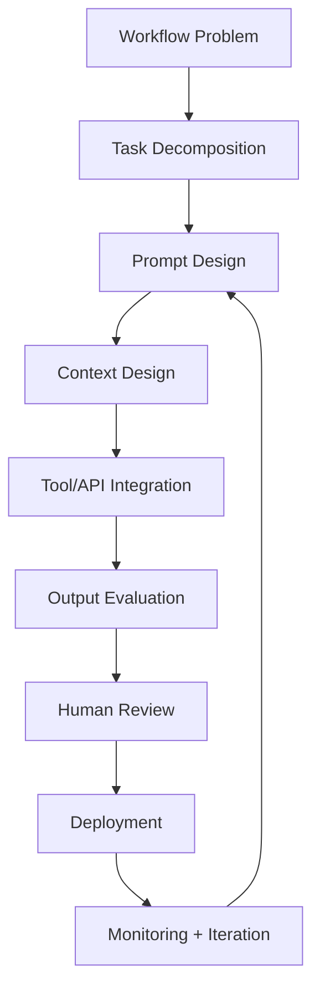

# Prompt Engineering Operating Model

From workflow friction to evaluated AI systems.

**PEOM Classification:** `PROOF_ASSET`  
**Use Case:** AI infrastructure startup interview/prospect artifact  
**Output:** GitHub Pages outline

# Prompt Engineering Operating Model  
## From Workflow Friction to Evaluated AI Systems

**Hero Section**

**Headline:**  
Prompt Engineering Is Infrastructure Now

**Subheadline:**  
A practical operating model for identifying, designing, evaluating, governing, and deploying internal LLM workflows inside high-growth AI infrastructure companies.

**Positioning line:**  
The question is not whether employees can use AI. The question is whether the company can turn high-friction workflows into reliable, evaluated, human-governed AI systems.

**CTA buttons:**  
- View Operating Model  
- See 30-Day Pilot Plan  
- Review Evaluation Layer

---

**Section 1: Executive Brief**

AI infrastructure companies cannot afford sloppy internal AI adoption.

The same rigor applied to infrastructure products should apply to internal AI workflows.

Prompt engineering is not random experimentation. It is workflow analysis, context design, output evaluation, governance, and adoption applied to business workflows that need reliability.

---

**Section 2: The Three Questions**

**For the C-suite:**  
Which internal workflow, if improved by 30%, would create the most leverage without increasing operational risk?

**For AI / Engineering Leadership:**  
Are prompts being treated as product infrastructure with versioning, evaluation, and regression checks, or as one-off instructions?

**For Operations:**  
Where are high-context employees repeatedly translating messy information into decisions AI could support, but not fully own?

---

**Section 3: Workflow Opportunity Intake**

Show a ranked intake model with 10 scoring dimensions:

- Business impact
- Current friction
- Manual hours burned
- Named workflow owner
- Data availability
- Tool/API access
- LLM suitability
- Decision risk
- Human review point
- Measurable success metric

**Verdict bands:**

| Score | Decision |
|---|---|
| 40-50 | Build First |
| 30-39 | Build Conditional |
| 20-29 | Prepare First |
| Below 20 | Do Not Build Yet |

---

**Section 4: Prompt Engineering Lifecycle**

Display as a horizontal or vertical workflow diagram:

**Supporting copy:**  
A prompt that works once is not infrastructure. A prompt that is decomposed, evaluated, versioned, monitored, and owned can become infrastructure.

---

**Section 5: Evaluation Layer**

This should be the strongest section.

| Evaluation Area | Question |
|---|---|
| Accuracy | Is the output correct against ground truth? |
| Consistency | Does the same input produce stable outputs? |
| Grounding | Are claims supported by provided context? |
| Hallucination | Did the model invent facts or assumptions? |
| Edge Cases | Does it handle malformed or incomplete inputs? |
| Task Completion | Did it complete the actual business task? |
| User Acceptance | Would the workflow owner approve it? |
| Regression | Do prior test cases still pass after changes? |
| Business Impact | Did time, quality, risk, or throughput improve? |

**Deployment rule:**  
No evaluation layer, no production workflow.

---

**Section 6: Example Internal AI Workflows**

| Workflow | AI Role | Human Owner | Risk |
|---|---|---|---|
| C-suite briefing assistant | Summarize and synthesize operational updates | Executive operations | Accuracy |
| Security questionnaire assistant | Retrieve and draft structured responses | Security/legal | Compliance |
| Engineering knowledge copilot | Retrieve internal system knowledge | Engineering lead | Hallucination |
| Sales technical response assistant | Draft technical answers for prospects | Sales engineering | Claim accuracy |
| Product feedback classifier | Summarize and classify user feedback | Product manager | Loss of nuance |
| Internal SOP assistant | Answer policy/process questions | Operations owner | Outdated source material |

---

**Section 7: Governance Layer**

Every deployed prompt workflow needs:

- Versioned prompt artifact
- Named workflow owner
- Human approval point
- Evaluation log
- Runtime escalation criteria
- Sensitive data rule
- Regression suite
- Monitoring cadence

**Strong line:**  
If no human owns the workflow, the AI should not own the outcome.

---

**Section 8: 30-Day Pilot Plan**

| Week | Focus | Output |
|---|---|---|
| Week 1 | Workflow discovery | Ranked workflow candidates |
| Week 2 | Prompt and context prototype | First working workflow prototype |
| Week 3 | Evaluation and feedback | Eval matrix, test cases, revisions |
| Week 4 | Limited pilot and readout | Executive summary and next-build recommendation |

**Executive readout format:**

1. What workflow was selected  
2. What the evaluation showed  
3. What business impact was observed  
4. What governance was required  
5. What should be built next  

---

**Section 9: Closing Thesis**

Prompt engineering is no longer a side skill.

Inside an AI infrastructure company, it becomes part of the operating system: how workflows are discovered, how model behavior is shaped, how quality is measured, and how trust is preserved before AI touches consequential work.

**Final line:**  
The goal is not more AI usage. The goal is deployable AI behavior the business can trust.

